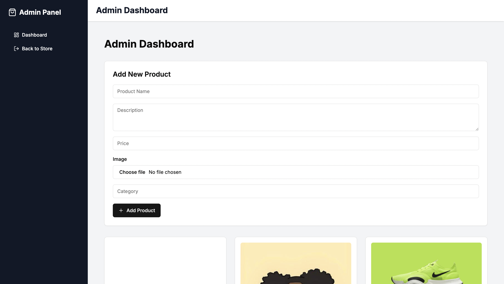

<div align="center">
  <h2 align="center">Ecommerce Admin Backend</h2>

Ecommerce Admin Backend is a Node.js API for managing products, users, and orders, with MongoDB for secure data storage. <br/> Built using Node.js <br/>

  <a href=""><strong>➥ Live Demo</strong></a>

</div>

<br />

### Demo Screeshots



### Prerequisites

Before you begin, ensure you have met the following requirements:

* [Git](https://git-scm.com/downloads "Download Git") must be installed on your operating system.

### Installing ecom admin backend

To install **ecom admin backend**, run this command on your git bash:

Linux and macOS:

```bash
sudo git clone https://github.com/rolandaayo/ecom-admin-backend.git
```

Windows:

```bash
git clone https://github.com/rolandaayo/ecom-admin-backend.git
```

## 💬 Contact

If you have an offer, opportunity, or introduction that might make my life more interesting, email me at ibiwoyeroland@gmail.com.

For the reasons stated above, I'll only respond to proposals that are matched for my schedule and interests.

### License

This project is **free to use** and does not contains any license.
